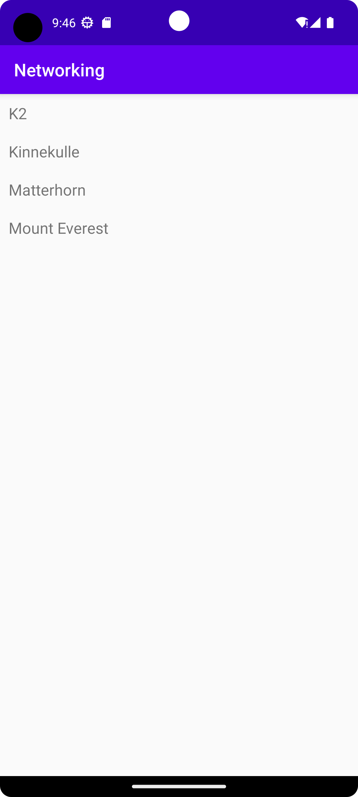

# Rapport

**Skriv din rapport här!**

Jag började med att lägga till en recyclerview som ska visa de olika mountainitems.
Sedan skapades en arraylist. Efter det så skapade jag
en recyclerview adapter och en viewholder. Sedan ändrades JSON url så att den kan hämta rätt
information. Mot slutet lades adapter.notifyDataSetChanged() till så att adaptern kan uppdatera
recyclerview. 


```
public void onPostExecute(String json) {
        Log.d("MainActivity", json);

        Gson gson = new Gson();
        Type type = new TypeToken<List<MountainItem>>() {}.getType();
                mtList = gson.fromJson(json, type);


        RecyclerViewAdapter adapter = new RecyclerViewAdapter(this, mtList, new RecyclerViewAdapter.OnClickListener() {
            @Override
            public void onClick(MountainItem item) {
                Toast.makeText(MainActivity.this, item.getName(), Toast.LENGTH_SHORT).show();
            }
        });

        RecyclerView view = findViewById(R.id.recycler_view);
        view.setLayoutManager(new LinearLayoutManager(this));
        adapter.notifyDataSetChanged();
        view.setAdapter(adapter);
    }
```

Bilder läggs i samma mapp som markdown-filen.



Läs gärna:

- Boulos, M.N.K., Warren, J., Gong, J. & Yue, P. (2010) Web GIS in practice VIII: HTML5 and the canvas element for interactive online mapping. International journal of health geographics 9, 14. Shin, Y. &
- Wunsche, B.C. (2013) A smartphone-based golf simulation exercise game for supporting arthritis patients. 2013 28th International Conference of Image and Vision Computing New Zealand (IVCNZ), IEEE, pp. 459–464.
- Wohlin, C., Runeson, P., Höst, M., Ohlsson, M.C., Regnell, B., Wesslén, A. (2012) Experimentation in Software Engineering, Berlin, Heidelberg: Springer Berlin Heidelberg.
